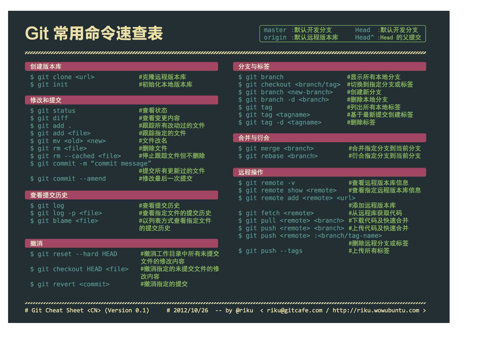

# git使用手册

+ 查看状态`git status`
+ 提交前`git add . 或者 git add a.txt 或者 git rm a.txt`
+ 提交的备注信息`git commit -m '这里是备注信息'`
+ 提交`git push -u origin master`
+ 拉取远程代码`git pull origin master`
+ 查看分支`git branch -a`
+ 新建分支`git branch 分支名`
+ 创建分支并切换到分支上`git branch -b 分支名`
+ 删除分支`git branch -d 分支名`
+ 把本地分支推送到远端`git push origin 分支名:分支名`
+ 清除远程不存在的分支`git fetch --prune`
+ 切换分支`git checkout 分支名`
+ 合并分支,把某个分支合并到master主分支上`git merge 分支名`
+ 克隆远程仓库`git clone 远程仓库的地址`
+ 添加远程仓库地址(origin 是远程仓库的代名词)`git remote add origin 地址`
+ 查看日志`git log`
+ git pull之后查看代码跟新内容 `git diff HEAD^`
+ 显示工作目录与git仓库之间的差异`git diff HEAD`
+ 更新本地的远程分支目录`git remote update origin --prune`
+ 拉取新远程分支到本地`git checkout -b 本地分支 origin/远程分支`