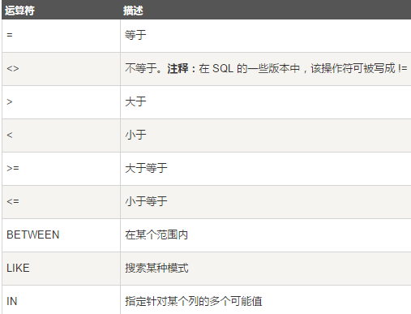

# sql语句
  
查询：`SELECT name,country FROM Websites;`  
去掉 "country" 列重复值：`SELECT DISTINCT country FROM Websites;`  
选取国家为 "CN" 的所有网站：`SELECT * FROM Websites WHERE country='CN';`  
逻辑运算的优先级：( ) > not > and  >  or  
```sql
select * from emp where not sal > 1500;
Select * from emp where comm is null;
Select * from emp where sal between 1500 and 3000;
```
查询 EMP 表 SAL 列中等于 5000，3000，1500 的值:  
```sql
Select * from emp where sal in (5000,3000,1500);
Select * from emp where ename like 'M%';
```
 % 表示多个字值，_ 下划线表示一个字符；  
 M% : 为能配符，正则表达式，表示的意思为模糊查询信息为 M 开头的。  
 %M% : 双百分号表示查询的信息在内容中间。  
 %M_% : 表示查询的字母在内容的倒数第二位  
`SELECT * FROM Websites ORDER BY country,alexa;`
默认 ASC（升序）。DESC（降序）。  
```sql
INSERT INTO Websites (name, url, alexa, country) 
VALUES ('百度','https://www.baidu.com/','4','CN');
UPDATE Websites SET alexa='5000', country='USA' WHERE name='菜鸟教程';
```
执行没有 WHERE 子句的 UPDATE 要慎重（容易吧所有数据都替换了）。  
`DELETE FROM Websites WHERE name='百度' AND country='CN';`  
您可以在不删除表的情况下，删除表中所有的行。这意味着表结构、属性、索引将保持不变：  
`DELETE FROM table_name;或DELETE * FROM table_name;`  
查询选取头5条记录：
```sql
MySQL： SELECT * FROM Persons LIMIT 5;
Oracle：SELECT * FROM Persons WHERE ROWNUM <=5;
SELECT * FROM Websites WHERE name IN ('Google','菜鸟教程');
SELECT * FROM access_log
WHERE date BETWEEN '2016-05-10' AND '2016-05-14';
```
把三个列（url、alexa 和 country）结合在一起，并创建一个名为 "site_info" 的别名：
```sql
SELECT name, CONCAT(url, ', ', alexa, ', ', country) AS site_info FROM Websites;
SELECT w.name, w.url, a.count, a.date  FROM Websites AS w, access_log AS a WHERE a.site_id=w.id and w.name="菜鸟教程";
```
INNER JOIN：如果表中有至少一个匹配，则返回行  
LEFT JOIN：即使右表中没有匹配，也从左表返回所有的行  
RIGHT JOIN：即使左表中没有匹配，也从右表返回所有的行  
FULL JOIN：只要其中一个表中存在匹配，则返回行
```sql
SELECT Websites.id, Websites.name, access_log.count, access_log.date
FROM Websites  INNER JOIN access_log
ON Websites.id=access_log.site_id;
```
LEFT JOIN 关键字从左表（table1）返回所有的行，即使右表（table2）中没有匹配。如果右表中没有匹配，则结果为 NULL。
```sql
SELECT Websites.name, access_log.count, access_log.date
FROM Websites LEFT JOIN access_log ON Websites.id=access_log.site_id
ORDER BY access_log.count DESC;
```
RIGHT JOIN 关键字从右表（table2）返回所有的行，即使左表（table1）中没有匹配。如果左表中没有匹配，则结果为 NULL。
```sql
SELECT Websites.name, access_log.count, access_log.date 
FROM access_log RIGHT JOIN Websites ON access_log.site_id=Websites.id 
ORDER BY access_log.count DESC;
```
默认地，UNION 操作符选取不同的值。如果允许重复的值，请使用 UNION ALL。  
UNION 结果集中的列名总是等于 UNION 中第一个 SELECT 语句中的列名。
```sql
SELECT country, name FROM Websites  WHERE country='CN'
UNION ALL
SELECT country, app_name FROM apps
WHERE country='CN'
ORDER BY country;
```
```sql
CREATE DATABASE my_db;
CREATE TABLE Persons
(PersonID int,LastName varchar(255),FirstName varchar(255));
CREATE TABLE Persons
( P_Id int NOT NULL, LastName varchar(255) NOT NULL, FirstName varchar(255),
Address varchar(255), City varchar(255)   )
```
每个表可以有多个 UNIQUE 约束，但是每个表只能有一个 PRIMARY KEY 约束。
```sql
DROP TABLE IF EXISTS `apps`;
CREATE TABLE `apps` (   `id` int(11) NOT NULL AUTO_INCREMENT,
  `app_name` char(20) NOT NULL DEFAULT '' COMMENT '站点名称',
  `url` varchar(255) NOT NULL DEFAULT '',
  `country` char(10) NOT NULL DEFAULT '' COMMENT '国家',
  PRIMARY KEY (`id`)  )
MySQL：CREATE TABLE Orders
(O_Id int NOT NULL, OrderNo int NOT NULL, P_Id int,
PRIMARY KEY (O_Id), FOREIGN KEY (P_Id) REFERENCES Persons(P_Id) )
Oracle：CREATE TABLE Orders
(O_Id int NOT NULL PRIMARY KEY, OrderNo int NOT NULL,
P_Id int FOREIGN KEY REFERENCES Persons(P_Id))
MySQL：CREATE TABLE Persons
( P_Id int NOT NULL, LastName varchar(255) NOT NULL, FirstName varchar(255),
Address varchar(255), City varchar(255), CHECK (P_Id>0) )
Oracle：CREATE TABLE Persons
( P_Id int NOT NULL CHECK (P_Id>0), LastName varchar(255) NOT NULL,
FirstName varchar(255), Address varchar(255), City varchar(255) )
```
DROP TABLE 语句用于删除表。  `DROP TABLE table_name`  
DROP DATABASE 语句用于删除数据库。 `DROP DATABASE database_name`  
改变表中列的数据类型：`ALTER TABLE table_name MODIFY column_name datatype;`  
```sql
CREATE TABLE Persons
( ID int NOT NULL AUTO_INCREMENT, LastName varchar(255) NOT NULL,
FirstName varchar(255), Address varchar(255), City varchar(255), PRIMARY KEY (ID))
CREATE OR REPLACE VIEW view_name AS
SELECT column_name(s)   FROM table_name   WHERE condition ;
SELECT * FROM Orders WHERE OrderDate='2008-11-11' ;
SELECT LastName,FirstName,Address FROM Persons  WHERE Address IS NULL;
SELECT LastName,FirstName,Address FROM Persons WHERE Address IS NOT NULL;
SELECT AVG(count) AS CountAverage FROM access_log;
SELECT COUNT(count) AS nums FROM access_log  WHERE site_id=3;
SELECT MAX(alexa) AS max_alexa FROM Websites;
SELECT MIN(alexa) AS min_alexa FROM Websites;
SELECT SUM(count) AS nums FROM access_log;
```
```sql
SELECT site_id, SUM(access_log.count) AS nums
FROM access_log GROUP BY site_id;
```
```sql
SELECT Websites.name, SUM(access_log.count) AS nums FROM Websites
INNER JOIN access_log
ON Websites.id=access_log.site_id
WHERE Websites.alexa < 200
GROUP BY Websites.name
HAVING SUM(access_log.count) > 200;
```
```sql
SELECT name, LENGTH(url) as LengthOfURL   FROM Websites;
SELECT name, url, Now() AS date  FROM Websites;
SELECT name, url, DATE_FORMAT(Now(),'%Y-%m-%d') AS date   FROM Websites;
```